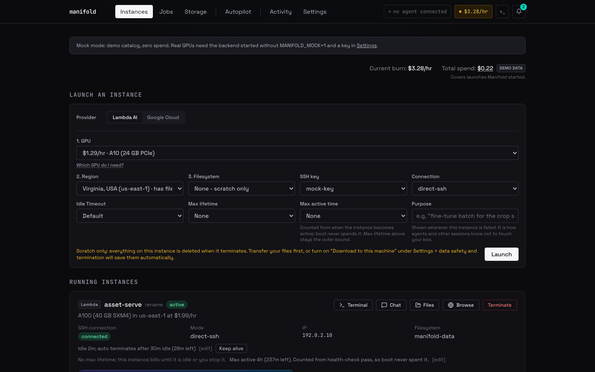
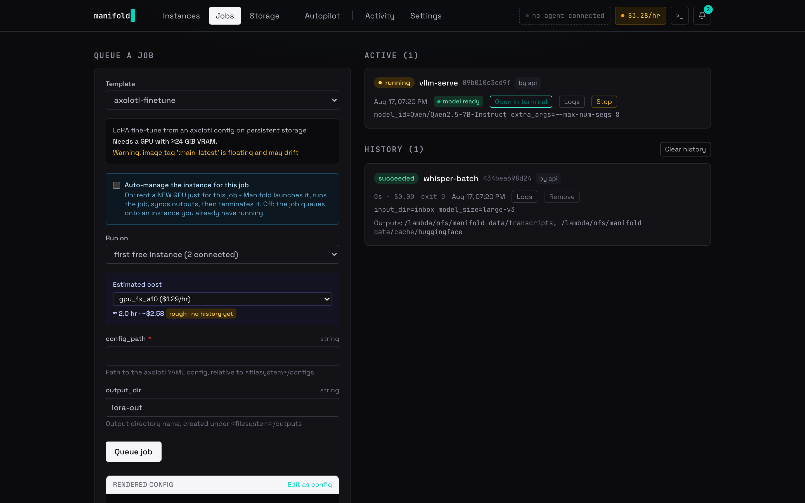
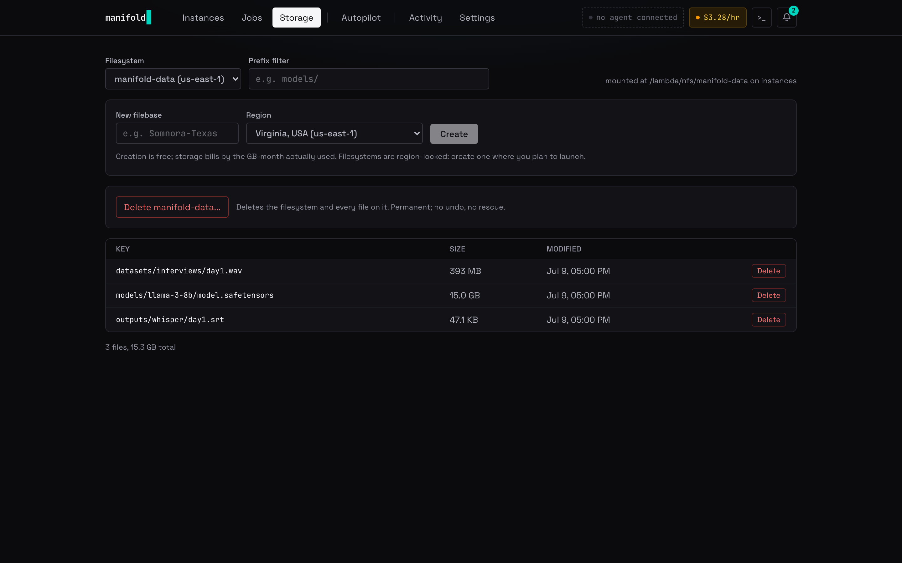
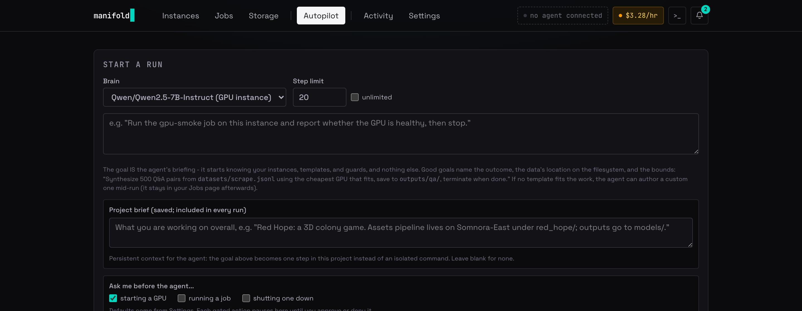

# Manifold

A local cockpit for Lambda Cloud GPUs: launch, work, and shut down without
ever losing a file or leaking a dollar. One guarded FastAPI backend owns
every action; a dashboard, a desktop app, and an MCP server for AI agents
are all thin clients of it.



## Try it in 90 seconds, no credentials

Mock mode runs the entire product against a simulated Lambda cloud: full
catalog, launches, jobs, terminals, telemetry. Zero spend, no API key.

You need [uv](https://docs.astral.sh/uv/getting-started/installation/) for
the Python side and [Node](https://nodejs.org/) 20+ for the dashboard.
Neither ships with macOS or Linux by default:

```bash
# macOS / Linux
curl -LsSf https://astral.sh/uv/install.sh | sh    # or: brew install uv
node --version                                     # need v20 or newer
```

```bash
# terminal 1: backend (from backend/)
uv sync
MANIFOLD_MOCK=1 uv run uvicorn app.main:create_default_app --factory

# terminal 2: dashboard (from dashboard/)
npm install && npm run dev    # then open http://localhost:3000
```

Launch an instance, queue a `vllm-serve` job, watch it go ready, open the
chat. Everything you see works identically against the real cloud once a
Lambda API key is pasted into Settings.

**Know your hardware.** The launch form carries a built-in guide to the
whole ladder, from a single A10 to an 8x B200 node: what each card is for,
when to step up, and what fits on it - with live provider prices and the
capability arithmetic labelled as arithmetic, never asserted.

**Two clouds, one door.** Lambda is the first-class provider. Google Cloud
works through the same guarded backend: launches ride your own
`gcloud auth application-default login` (a browser OAuth - no API key ever
touches Manifold), the catalog shows live zone availability with dated
list prices labelled as such, and your GPU quota appears on the launch
form before you click, because fresh GCP projects hold zero and that
blocks more first launches than anything else. New and scratch-only for
now; see docs/gcp.md.

## Why it exists

Renting a GPU is easy. Renting one *safely* is not. Manifold's backend is
the single gateway for every action, and the guards live there, not in any
client:

- **Spend guards.** Budget cap, concurrency limit, and a live burn rate in
  the header. Idle instances auto-terminate (default 30 min, keep-alive one
  click away), and the sweep checks the GPU before it acts: a box at 100%
  utilization is never "idle", even when the work driving it is invisible
  to Manifold. Two ceilings bound every launch: max lifetime (absolute, boot
  included) and max active time (counted from health-check pass, so a slow
  boot never spends your run budget). Capacity watches can auto-launch the
  moment a region frees up. Even filesystem storage, which the provider's
  API does not price, appears as a labeled estimate at a rate you configure.
- **Termination saves before it destroys.** Shutting down first rescues
  ephemeral files per your data-safety policy, and refuses if something
  could not be saved. There is exactly one explicit "burn it" override.
- **Nothing listens on the network.** GPU instances expose sshd and nothing
  else; model servers bind to loopback and are reached only through the
  managed SSH connection. The OpenAI-compatible proxy on your machine is the
  one public face.
- **Everything is audited.** Every launch, job, command, and agent tool call
  lands in one audit log that is never pruned. It once reconstructed a night
  of cross-agent terminations that two sessions remembered differently; the
  log was the account both accepted.

## Jobs, not shell sessions

Work is YAML job templates run as supervised containers: `vllm-serve`,
`sglang-serve`, `whisper-batch`, `axolotl-finetune`, `llm-synthesize`,
`lora-merge`, `sdxl-generate`, `script-run`, and more. Jobs stream logs,
survive backend restarts, and can auto-manage their own instance: rent a
GPU, run, sync outputs, terminate. Templates take tuning flags through a
per-template allowlist (`extra_args: "--max-num-seqs 8"` on vllm-serve);
anything outside the list is refused at enqueue with the list in the error.
For long work that fits no template, `run_detached` starts a command that
survives disconnects and backend restarts, records its exit code, and
counts as activity, so the box protects itself from the idle sweep while
an rsync or a compile runs.



The whole distillation loop is templates end to end: `llm-synthesize`
(teacher writes a training set) -> `axolotl-finetune` (LoRA on the student)
-> `lora-merge` (fold the adapter into a standalone model) -> `vllm-serve`
(serve your model by path). See `docs/distill-your-own-model.md`.

Persistent filesystems are first-class: browse, upload, download, and create
new filebases in any region from the Storage page.



## Built for AI agents

Any MCP client (Claude Code, Claude Desktop, Codex, Gemini CLI) gets 41
tools that flow through the same guarded backend, so an agent hits the same
budget walls you do. Several agents can share one account safely: every
launch carries a required `purpose` and a `created_by`, every instance
reports the idle sweep's own verdict on whether it is busy (with "cannot
tell" as a real answer, never dressed as "no"), and terminating another
principal's box is refused unless the caller names the owner. That design
came from a real incident: one agent terminated another's model server
mid-load because every cheap signal said the box was idle. The fix was not
asking agents to be more careful; it was making the payload carry the
facts.

With the desktop app installed, registration is one line, no dev checkout:

```bash
claude mcp add manifold --scope user -- "/Applications/Manifold.app/Contents/MacOS/manifold-backend" --mcp
```

`--scope user` is the part people miss: without it Claude Code registers
Manifold for sessions started in ONE directory, and from every other repo
that is indistinguishable from "not installed". An agent told "Manifold is
open for you to use" then cannot find it, and the GPU bills while everyone
looks in the wrong place.

The agent's first call, `get_skill`, returns a playbook of recipes (launch,
serve, batch, fine-tune, teardown) and the rules that keep GPU work safe.
Full setup for every client: `docs/mcp-setup.md`.

To check the wiring instead of guessing, ask the app:

```bash
/Applications/Manifold.app/Contents/MacOS/manifold-backend --doctor
```

It reports whether a backend is answering (real or mock), whether an API
token exists and is accepted (status only, never the value), which agent
configs register Manifold and at what scope, and what is running. It exits
nonzero when an agent would be blocked, and every failure line carries the
command that fixes it. The backend also writes `~/.config/manifold/manifold.json`
on every boot, so an agent that has never heard of Manifold can find it by
looking where it already looks. The dashboard says "no agent connected"
until the first MCP call ever arrives.

There is also Autopilot, an agent loop that runs *inside* Manifold, driven
by any brain: a model served on your own instance, a local Ollama or
LM Studio model, or a frontier API. Spend actions pause for your approval.



And the OpenAI-compatible proxy at `localhost:8000/v1` points any existing
tool (aider, opencode, your own scripts) at a model served on your GPU. A
running serve job's card has an "Open in terminal" button that opens a local
shell already wired to it.

## Desktop app

One .dmg: a Tauri shell around the same backend with the dashboard bundled.
First run asks for your Lambda API key, validates it, and stores it locally.
Build instructions: `docs/desktop-build.md`.

## Layout

- `backend/` FastAPI orchestrator (Python 3.11+, SQLite, asyncssh)
- `dashboard/` Next.js dashboard
- `templates/` bundled YAML job templates
- `docs/` user guides (MCP setup, distillation, data pipelines, proxy)
- `DECISIONS.md` running log of every non-obvious choice and why
- `CLAUDE.md` build/run/test reference

## Development

```bash
cd backend
uv sync
uv run pytest          # 1,190+ tests, all against mocks; no live spend
```

Hard rules: no live spend in tests, all guards live in the backend, clients
never get a path around them. The full list is in `CLAUDE.md`, and
`CONTRIBUTING.md` explains how to work with them.

## License

MIT. See `LICENSE`.
